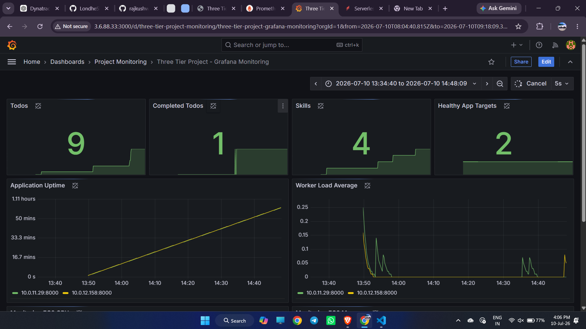

# Three-Tier Application Infrastructure with AWS Guardrails using Terraform

## Project Overview

This project provisions a complete production-style **Three-Tier Application Infrastructure** on AWS using **Terraform** and deploys the application on **Amazon EKS**.

The primary goal of this project is to demonstrate how infrastructure guardrails can be enforced while deploying cloud-native applications.

The infrastructure includes:

- Secure networking (VPC)
- Amazon EKS
- Amazon ECR
- Amazon RDS (Private)
- AWS WAF
- IAM & IAM Identity Center
- Monitoring (Prometheus, Grafana, CloudWatch)
- Autoscaling (HPA)
- Security Guardrails
- Kubernetes Deployment using Helm

---

# Architecture

```
                   Internet
                       │
                Route53 (Optional)
                       │
                 Application Load Balancer
                       │
                 AWS WAF Web ACL
                       │
          AWS Load Balancer Controller
                       │
                 Kubernetes Ingress
                       │
        ┌──────────────┴──────────────┐
        │                             │
   Frontend Service             Backend Service
        │                             │
  Frontend Pods                 Backend Pods
                                      │
                              Amazon RDS (Private)
```
## Grafana Monitoring Dashboard


---

# Technology Stack

## Cloud Services

- AWS Organizations
- AWS IAM
- AWS IAM Identity Center (Optional)
- AWS Config
- AWS CloudTrail
- AWS VPC
- Public & Private Subnets
- Internet Gateway
- NAT Gateway
- Route Tables
- Security Groups
- VPC Flow Logs
- Amazon EKS
- Amazon ECR
- AWS Load Balancer Controller
- Application Load Balancer
- AWS WAF
- Amazon RDS
- AWS Secrets Manager
- AWS KMS
- Amazon CloudWatch
- Amazon Route53 (Optional)

---

## Kubernetes Components

- Namespace
- Deployment
- Service
- Ingress
- ConfigMap
- Secret
- Horizontal Pod Autoscaler (HPA)
- Metrics Server
- Prometheus
- Grafana
- Alertmanager

---

## DevOps Tools

- Terraform
- AWS CLI
- kubectl
- Helm
- Docker
- Git
- GitHub Actions / Jenkins
- tflint
- tfsec / Checkov
- OPA Gatekeeper / Kyverno (Optional)

---

# Project Structure

```
three-tier-guardrails-terraform/

├── README.md
│
├── environments/
│   ├── dev/
│   │   ├── provider.tf
│   │   ├── backend.tf
│   │   ├── variables.tf
│   │   ├── terraform.tfvars
│   │   └── main.tf
│   │
│   └── prod/
│       ├── provider.tf
│       ├── backend.tf
│       ├── variables.tf
│       ├── terraform.tfvars
│       └── main.tf
│
├── modules/
│   ├── guardrails/
│   ├── iam/
│   ├── vpc/
│   ├── eks/
│   ├── ecr/
│   ├── rds/
│   ├── waf/
│   ├── monitoring/
│   └── app/
│
└── kubernetes/
    ├── namespace/
    ├── frontend/
    ├── backend/
    ├── ingress/
    ├── hpa/
    ├── monitoring/
    └── secrets/
```

---

# Terraform Environments

## Development

```hcl
environment = "dev"

aws_region = "ap-south-1"

required_tags = {
  Environment = "dev"
  Project     = "three-tier-app"
  Owner       = "devops"
}
```

---

## Production

```hcl
environment = "prod"

aws_region = "ap-south-1"

required_tags = {
  Environment = "prod"
  Project     = "three-tier-app"
  Owner       = "devops"
}
```

---

# Infrastructure Modules

## Guardrails Module

Responsible for implementing governance controls.

Creates:

- Service Control Policies (SCP)
- AWS Config Rules
- Required Tag Policies
- Region Restrictions

---

## VPC Module

Creates:

- VPC
- Public Subnets
- Private Subnets
- Internet Gateway
- NAT Gateway
- Route Tables
- VPC Flow Logs
- Security Groups

---

## IAM Module

Creates:

- IAM Roles
- IAM Policies
- EKS IAM Roles
- OIDC Provider

---

## Amazon EKS Module

Creates:

- EKS Cluster
- Managed Node Groups
- OIDC Provider
- IAM Roles
- Security Groups

---

## Amazon ECR Module

Creates repositories for:

- Frontend Image
- Backend Image

---

## Amazon RDS Module

Creates:

- Private RDS Instance
- DB Subnet Group
- Parameter Group
- Secrets Manager Secret
- KMS Encryption

---

## WAF Module

Creates:

- AWS WAF Web ACL
- AWS Managed Rule Groups
- Rate Limiting Rules
- Association with Application Load Balancer

---

## Monitoring Module

Deploys:

- Prometheus
- Grafana
- Alertmanager
- CloudWatch Integration
- Dashboards
- Alert Rules

---

# Kubernetes Deployment

The application consists of:

## Frontend

- Deployment
- Service
- HPA

---

## Backend (Go API)

- Deployment
- Service
- ConfigMap
- Secret
- HPA

---

## Database

- Amazon RDS (Private)

---

## Ingress

AWS Load Balancer Controller provisions an Application Load Balancer.

Traffic Flow:

```
Internet

↓

AWS ALB

↓

AWS WAF

↓

Ingress

↓

Frontend Service

↓

Backend Service

↓

Amazon RDS
```

---

# Guardrails Implemented

## Guardrail 1 - Approved AWS Region

Only approved AWS regions are allowed.

Example:

Allowed

```
ap-south-1
```

Blocked

```
us-east-1
```

---

## Guardrail 2 - Mandatory Resource Tags

Every resource must include:

```
Environment
Project
Owner
```

Deployment fails if tags are missing.

---

## Guardrail 3 - Environment Subnet Validation

Development workloads can only use:

```
Environment = dev
```

Production workloads can only use:

```
Environment = prod
```

---

## Guardrail 4 - Private Database

Amazon RDS:

```
publicly_accessible = false
```

Database is deployed only inside private subnets.

---

## Guardrail 5 - Database Security

Database Security Group allows access only from:

```
Backend Security Group
```

No public access is allowed.

Blocked:

```
0.0.0.0/0
```

---

## Guardrail 6 - WAF Enforcement

Every public Application Load Balancer must have:

- AWS WAF
- AWS Managed Rules

---

## Guardrail 7 - Monitoring Enforcement

Infrastructure must include monitoring using:

- Prometheus
- Grafana

or

- Amazon CloudWatch

---

## Guardrail 8 - Horizontal Pod Autoscaler

Both frontend and backend deployments must have HPA enabled.

---

# Deployment Order

## Step 1

Create Terraform project structure.

---

## Step 2

Deploy Guardrails Module

- SCP
- AWS Config
- Required Tags

---

## Step 3

Deploy VPC

- VPC
- Subnets
- NAT Gateway
- Route Tables

---

## Step 4

Deploy Amazon EKS

- Cluster
- Node Groups
- IAM
- OIDC

---

## Step 5

Deploy Amazon ECR

- Frontend Repository
- Backend Repository

---

## Step 6

Deploy Amazon RDS

- Private Database
- Secrets Manager

---

## Step 7

Install Kubernetes Controllers

- AWS Load Balancer Controller
- Metrics Server

---

## Step 8

Deploy AWS WAF

- Web ACL
- Managed Rules

---

## Step 9

Deploy Three-Tier Application

- Frontend
- Backend
- Services
- Ingress
- HPA

---

## Step 10

Deploy Monitoring Stack

- Prometheus
- Grafana
- Alertmanager
- Dashboards

---

## Step 11

Validate Guardrails

Test scenarios:

- Deploy in wrong AWS Region
- Deploy without required tags
- Create public RDS
- Use incorrect subnet
- Remove WAF
- Disable HPA
- Disable monitoring

Expected Result:

Terraform should prevent deployment or AWS Config should detect and report non-compliance.

---

# Deployment Commands

Initialize Terraform

```bash
terraform init
```

Validate configuration

```bash
terraform validate
```

Check formatting

```bash
terraform fmt -recursive
```

Run TFLint

```bash
tflint
```

Run Security Scan

```bash
tfsec
```

or

```bash
checkov -d .
```

Review execution plan

```bash
terraform plan
```

Apply infrastructure

```bash
terraform apply
```

---

# Future Enhancements

- Multi-Region Disaster Recovery
- AWS Control Tower Integration
- GitOps with Argo CD
- External Secrets Operator
- AWS Backup Plans
- Karpenter for Node Autoscaling
- Kyverno / OPA Policy Enforcement
- Service Mesh (Istio)

---

# Learning Outcomes

After completing this project, you will understand:

- Infrastructure as Code using Terraform
- AWS Landing Zone concepts
- Cloud Governance and Guardrails
- Amazon EKS Architecture
- Secure Networking
- Kubernetes Deployments
- AWS WAF
- IAM Best Practices
- Monitoring with Prometheus & Grafana
- CI/CD Integration
- Production-ready Infrastructure Design

---

# Project Summary

This project demonstrates how to build a secure, production-ready AWS infrastructure using Terraform while enforcing governance through infrastructure guardrails. It provisions networking, Amazon EKS, Amazon ECR, private Amazon RDS, AWS WAF, monitoring, and autoscaling. The three-tier application is deployed on Kubernetes using Helm, showcasing best practices for security, scalability, observability, and infrastructure automation.